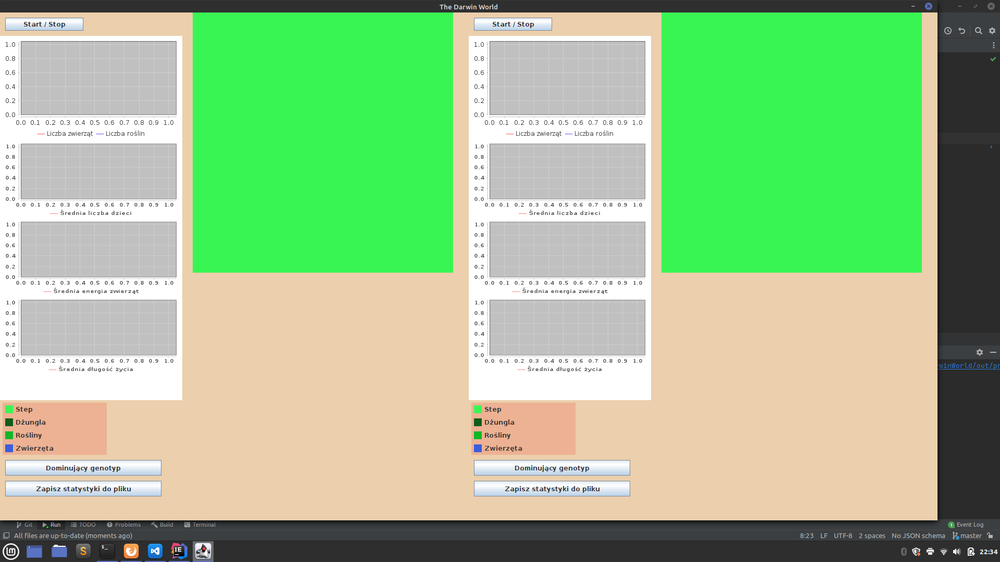
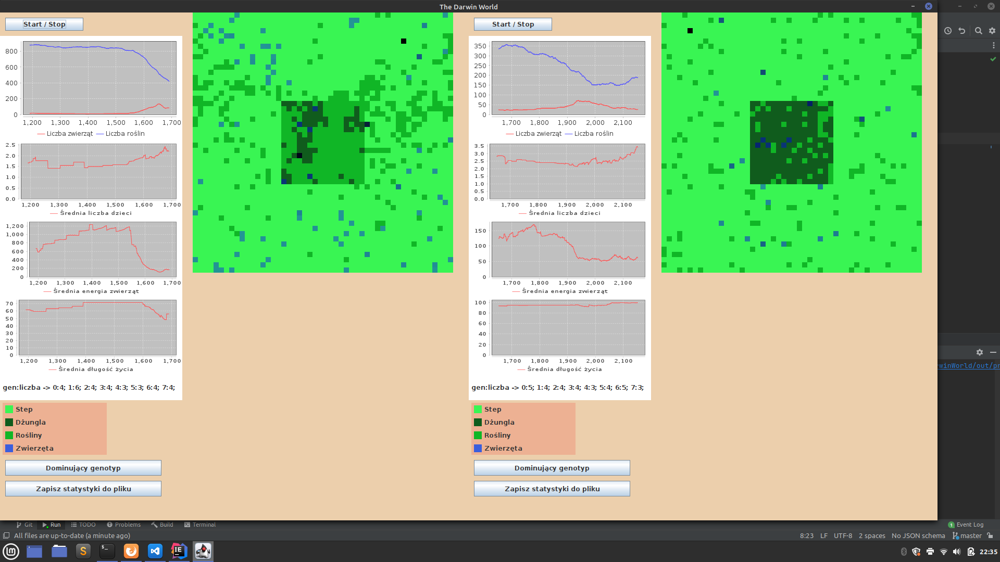

# Darwin World

My 1st project in JAVA for OOP (object-oriented programming) course at AGH UST in 2020.

In this app we can simulate two worlds and observe how they change. In simulation world there are animals and plants. Animals can eat, move and reproduce (they have genotype). Start parameters of map we can add via proper .json file.

